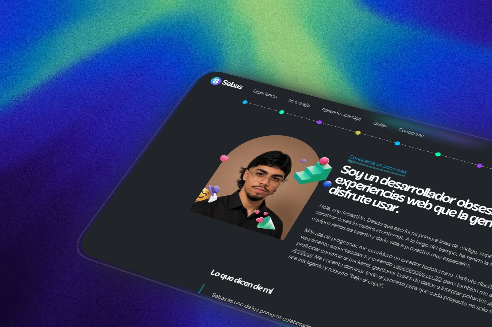

<div align="center">


  <h1> ✨💼 Sebastián Vásquez's Portfolio</h1>

  <p><em>Where others see technology, I see infinite possibilities.</em></p>

  <br />

  
  
  
  
  
  

  <br /><br />

  

</div>

---

<br />

## Index

- [About the project](#-about-the-project)
- [Design philosophy](#-design-philosophy)
- [Features](#-features)
- [Tech stack](#-tech-stack)
- [Project architecture](#-project-architecture)
- [Application flow](#-application-flow)
- [Main components](#-main-components)
- [Getting Started](#-getting-started)
- [Available scripts](#-available-scripts)
- [Performance and optimizations](#-performance-and-optimizations)
- [Responsive Design](#-responsive-design)
- [Contact](#-contact)
- [License](#-license)

---

<br />

## About the project

This portfolio is a single-page application built with **React 19**, **Vite 8**, and **Tailwind CSS 4**. It was born as a static site and migrated to a modern architecture with one clear goal: **convey quality from the very first pixel**.

Every section is designed as an independent editorial piece. It's not just a website with information — it's a **visual experience** that accompanies the visitor from the moment it loads until they close the tab.

> The project has no backend. It's a static SPA deployed on **Vercel**.

---

<br />

## Design philosophy

The portfolio's aesthetic follows a **high-end editorial style**. Every visual decision was made with intention:

| Principle | Implementation |
|---|---|
| **High-impact typography** | Custom *Acorn* font for headings, *Bricolage Grotesque* for subheadings, *Google Sans Flex* for body |
| **Breathing whitespace** | Clean layout with clear hierarchy between sections |
| **Advanced effects** | Apple-style Gradual Blur Header, glassmorphism on cards, custom cursor |
| **Movement with purpose** | Scroll animations, smooth transitions, hover micro-interactions |
| **Visual coherence** | Unified palette (green → blue → purple), consistent gradients, refined shadows |

> *Elegance should always be above quantity.*

---

<br />

## Features

### Fluid navigation
Powered by [Lenis Smooth Scroll](https://github.com/darkroomengineering/lenis), every scroll feels like a premium experience with a custom easing curve.

### Gradual Blur Header
A progressive blur effect inspired by Apple. The header gradually blurs as the user scrolls, adding depth and elegance without distractions.

### Smart loading screen
Not a fake timer. The preloader **loads real assets** in 7 phases (fonts → hero → experience → services → projects → blog → about → other) and displays actual progress. When finished, it slides up revealing the content.

### Projects with animated slider
Project categories (*Originals*, *Clones*, *UI/UX*, *Web 3D*) with an animated slider using **Framer Motion** with spring transitions and blur effects between panels.

### Bento Grid for services
Bento-style layout with glassmorphic cards that include color blobs as decorative backgrounds. Each service has its own gradient palette.

### Custom cursor
An 8px dot with a 40px follower ring, both using `mix-blend-mode: difference`. Automatically hidden on touch devices.

### Content entry animation
All content appears with a coordinated `opacity` + `translateY` transition, synchronized with the preloader exit.

---

<br />

## Tech stack

### Core

| Technology | Version | Purpose |
|---|---|---|
| **React** | 19.2.5 | UI framework |
| **Vite** | 8.0.10 | Build tool and dev server |
| **Tailwind CSS** | 4.2.4 | Utility-first styling |

### Animation and UX

| Library | Version | Purpose |
|---|---|---|
| **Framer Motion** | 12.38.0 | React animations (project slider) |
| **GSAP** | 3.15.0 | High-performance advanced animations |
| **Lenis** | 1.3.23 | Smooth scrolling |
| **OverlayScrollbars** | 2.15.1 | Custom scrollbar |

### Fonts

| Font | Purpose |
|---|---|
| **Acorn** | High-impact headings (display font) |
| **Bricolage Grotesque** | Secondary subheadings (300/600/800) |
| **Google Sans Flex** | Body text (400-800) |

---

<br />

## Project architecture

```
portfolio/
├── index.html                 # HTML entry point (lang="es")
├── package.json               # Dependencies and scripts
├── vite.config.js             # Vite configuration
│
├── src/
│   ├── main.jsx               # React entry point
│   ├── App.jsx                # Main orchestrator (loading, scroll, layout)
│   ├── index.css              # Global styles (3040 lines)
│   │
│   └── components/
│       ├── LoadingScreen.jsx  # Preloader with real asset loading
│       ├── Header.jsx         # Sticky nav with gradual blur + mobile menu
│       ├── Hero.jsx           # Main section with portrait and CTAs
│       ├── Experience.jsx     # Professional experience timeline
│       ├── Services.jsx       # Bento grid of services
│       ├── Projects.jsx       # Animated slider with 4 categories
│       ├── Blog.jsx           # Learning section
│       ├── Lab.jsx            # Genesis Pixel chapters
│       ├── About.jsx          # Personal bio + testimonials
│       ├── Footer.jsx         # Photo gallery + social links
│       ├── Icons.jsx          # SVG icon library
│       └── GradualBlur.jsx    # Progressive blur component (Apple-style)
│
├── css/
│   └── estilos.css            # Legacy CSS from the original static site
│
└── public/
    ├── fonts/                 # 8 font files
    └── img/                   # 70+ images (profiles, projects, emojis, decorations)
```

---

<br />

## Application flow

```
1. HTML loads → React mounts <App /> in StrictMode
          ↓
2. LoadingScreen mounts and starts preloading:
   → Fonts (2 Google Fonts URLs)
   → Images by phases: hero, experience, services,
     projects, blog, about, other (~55 images)
   → Progress bar + percentage + phase text
          ↓
3. All assets loaded:
   → Preloader triggers exit animation (slide-up)
   → onComplete → setIsLoading(false)
          ↓
4. Content reveal:
   → Double requestAnimationFrame ensures DOM is ready
   → contentState changes to 'enter' → fade-in + translateY (0.8s)
   → After 0.8s → headerReady = true → header appears
          ↓
5. User navigates with Lenis smooth scroll active
```

> The hero has a separate entry from the rest of the content. The header appears after the content has been fully revealed.

---

<br />

## Main components

### `App.jsx`
The orchestrator. Controls loading state, initializes Lenis, manages the content reveal sequence, and renders all sections in order.

### `LoadingScreen.jsx`
Complete preloader that loads real assets in 7 phases. Shows progress percentage, phase text, and profile avatar. Slides up with a CSS transition when finished.

### `Header.jsx`
Sticky nav with gradual blur using the `GradualBlur` component. Includes:
- Desktop navigation with animated SVG underline on hover
- "Let's Talk" button linking to WhatsApp
- Full-screen mobile menu with `scaleY` animation
- Scroll-to-top button that appears after 400px

### `Hero.jsx`
The first impression. Profile portrait, main heading, two CTAs (*"Check out what I've done"* and *"Download my CV"*), social links, and a portrait with a glassmorphic card and animated floating emojis.

### `Experience.jsx`
Vertical timeline with 3 professional experiences. Includes interactive screenshot grid with tooltips using React portals.

### `Projects.jsx`
Animated slider with 4 categories and 16 projects. Each category has its own background. Transitions use Framer Motion spring physics.

### `GradualBlur.jsx`
Reusable progressive blur component inspired by Apple. Supports presets, curves, Intersection Observer, and responsive mode.

---

<br />

## Getting Started

**1. Clone the repository**

```bash
git clone https://github.com/sebastianvasquezechavarria1234/portfolio.git
cd portfolio
```

**2. Install dependencies**

```bash
npm install
```

**3. Start the development server**

```bash
npm run dev
```

> It will automatically open at `http://localhost:5173`.

---

<br />

## Available scripts

| Script | Command | Description |
|---|---|---|
| **Development** | `npm run dev` | Starts the Vite dev server |
| **Build** | `npm run build` | Generates the production bundle in `dist/` |
| **Preview** | `npm run preview` | Previews the production build |
| **Lint** | `npm run lint` | Runs ESLint to detect errors |

---

<br />

## Performance and optimizations

- **Smart preloading**: The preloader loads real assets by phases, no fake timers
- **Optimized smooth scrolling**: Lenis with `smoothTouch: false` on mobile to preserve performance
- **WebP images**: Most assets use WebP format for smaller file size
- **Custom CSS**: CSS variables for reusable colors, gradients, and shadows
- **Memoized components**: `GradualBlur` uses `React.memo` to prevent unnecessary re-renders
- **Optimized bundle**: Vite generates a single JS and a single CSS for production
- **Lazy scroll-to-top**: The button only appears after 400px of scrolling

---

<br />

## Responsive Design

The portfolio adapts from ultra-wide displays to mobile with **12 breakpoints**:

| Breakpoint | Behavior |
|---|---|
| `1380px` | Padding and layout adjustments |
| `1280px` | Container overflow visible |
| `1180px` | Project grid switches to 2 columns |
| `1065px` | Font size reduction |
| `975px` | Services layout adjusted |
| `900px` | About section switches to `flex-col` |
| `800px` | Mobile menu activated, hamburger visible |
| `768px` | Desktop nav hidden, overlay menu |
| `600px` | Hero gradient to 100% width, 400px height |
| `500px` | Reduced font sizes |
| `480px` | Final adjustments for small mobile devices |


<br />


<br />


<p align="center">
  <strong>© 2023 — 2026 Sebastián Vásquez Echavarría</strong><br />
  <em>Designed and written in code with dedication and precision.</em>
  </br>
  Made with ❤️ by <a href="https://sebas-dev.vercel.app/" target="_blank" rel="noopener noreferrer">Sebastián V</a>

</p>


<div align="center">

  <a href="https://wa.me/573015857417" target="_blank">
    
  </a>
  <a href="https://www.linkedin.com/in/sebastian-vasquez-echavarria-839923302/" target="_blank">
    
  </a>
  <a href="https://github.com/sebastianvasquezechavarria1234" target="_blank">
    
  </a>
  <a href="https://instagram.com/sebastianechavarria1314/" target="_blank">
    
  </a>
  <a href="mailto:sebasvasquez1314@gmail.com" target="_blank">
    
  </a>

</div>
